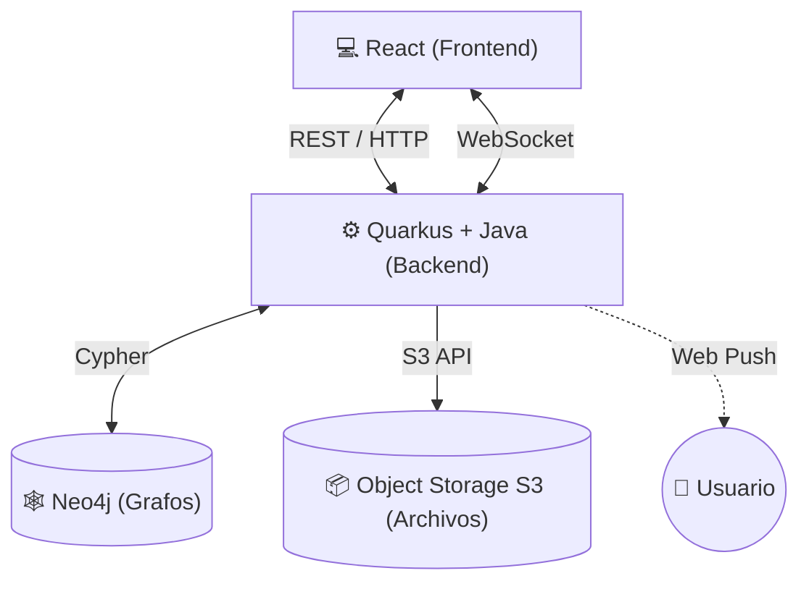

# Red Social Distribuida 

Proyecto práctico de diseño e implementación de una aplicación web distribuida que integra múltiples mecanismos de comunicación, persistencia y almacenamiento.

## Integrantes
- Said Pinto
- Oscar Gonzabay
- Jaen Estalin

## Descripción del Proyecto
Aplicación web distribuida basada en microservicios y grafos que implementa las funcionalidades esenciales de una red social[cite: 2]. El sistema separa estrictamente las responsabilidades, utilizando bases de datos orientadas a grafos para las relaciones sociales y almacenamiento de objetos para la multimedia[cite: 1, 2].

## Arquitectura

## Tecnologías Utilizadas
| Componente | Tecnología |
|---|---|
| **Frontend** | React[cite: 1, 2] |
| **Backend** | Quarkus + Java[cite: 1, 2] |
| **Base de Datos** | Neo4j (Grafos)[cite: 1, 2] |
| **Almacenamiento** | MinIO (Servicio compatible con S3)[cite: 1, 2] |
| **Tiempo Real** | WebSocket[cite: 1, 2] |
| **Notificaciones** | Web Push[cite: 1, 2] |
| **Despliegue** | Docker & Docker Compose[cite: 1, 2] |

## Instrucciones de Ejecución
1. Clonar el repositorio.
2. Levantar la infraestructura base ejecutando: `docker-compose up -d`[cite: 1].
3. *(Añadir los comandos para levantar Quarkus y React cuando estén configurados)*.

### Variables de Entorno Necesarias
- `NEO4J_URI`=bolt://localhost:7687
- `NEO4J_USER`=neo4j
- `NEO4J_PASSWORD`=...
- `S3_ENDPOINT`=http://localhost:9000
- `S3_ACCESS_KEY`=...
- `S3_SECRET_KEY`=...

## Modelo del Grafo
*(Aquí documentaremos los nodos como `(:Usuario)`, `(:Post)` y sus relaciones como `[:SIGUE]`, `[:PUBLICA]`, `[:REACCIONA]`)*[cite: 1, 2].

## Endpoints Principales (API REST)
- `POST /usuarios` - Registro de usuario[cite: 1].
- `GET /feed` - Obtener el feed personalizado del usuario[cite: 1].
*(Se completará conforme se desarrolle el backend)*

## Mecanismos de Comunicación Justificados
- **Uso de REST:** Explicación de por qué se usa para el CRUD convencional[cite: 1].
- **Uso de WebSocket:** Explicación de la conexión persistente bidireccional para el chat en tiempo real (diferencia con el polling tradicional)[cite: 1, 2].
- **Uso de Web Push:** Explicación del flujo de notificaciones fuera de la aplicación cuando un usuario seguido interactúa[cite: 1, 2].

## Consultas Cypher Desarrolladas
*(Aquí listaremos las 5 consultas Cypher no triviales, incluyendo el algoritmo de recomendación de usuarios que recorre más de 1 nivel)*[cite: 1, 2].

1. Consulta 1: ...
2. Consulta 2: ...
3. Consulta 3: ...
4. Consulta 4: ...
5. Consulta 5: ...

## Decisiones Técnicas Relevantes
*(Espacio para justificar por qué se separaron los archivos en S3, por qué no se usó una base relacional, etc.)*[cite: 1].

## Explicación de la Estructura del Proyecto

Dado que estamos utilizando herramientas nuevas y construyendo una arquitectura distribuida, la estructura de carpetas se diseñó para separar estrictamente las responsabilidades de cada tecnología. 

### Backend (`/backend`)
El backend utiliza **Quarkus + Java**, por lo que sigue el estándar de Maven (`src/main/java` y `src/main/resources`). Para evitar código espagueti, dividimos la lógica en capas:

*   **`config/`**: Archivos de configuración de seguridad, credenciales de S3 (MinIO) y conexión al grafo (Neo4j).
*   **`controller/`**: Únicamente los endpoints de nuestra API REST (ej. los `GET` y `POST` solicitados).
*   **`websocket/`**: La lógica exclusiva para mantener la conexión persistente del chat en tiempo real, separada del REST tradicional.
*   **`model/`**: Las entidades o nodos que vamos a guardar en Neo4j (ej. `Usuario`, `Post`).
*   **`repository/`**: Aquí irán nuestras consultas avanzadas de Cypher para comunicarse con Neo4j.
*   **`service/`**: La lógica de negocio pesada (ej. el algoritmo para recomendar amigos o la lógica para subir imágenes a S3).

### Frontend (`/frontend`)
En React, la clave es separar la interfaz (lo que el usuario ve) de la conexión con el servidor (cómo obtenemos los datos):

*   **`components/` & `pages/`**: Todo el diseño visual, botones, y vistas (Login, Feed, Chat).
*   **`services/`**: Esta es la carpeta más importante para la integración. Aquí se separa cómo el frontend habla con el backend:
    *   `api.js`: Para las llamadas REST clásicas (CRUD).
    *   `websocket.js`: Para manejar los mensajes del chat en tiempo real.
    *   `webpush.js`: Para registrar y escuchar las notificaciones push.
*   **`context/`**: Para mantener estados globales, como saber si el usuario inició sesión sin tener que pasarlo por cada componente.
*   **`public/service-worker.js`**: Archivo fundamental que corre en segundo plano en el navegador para recibir las notificaciones Web Push incluso si el usuario no está tocando la pantalla.

### Infraestructura Base (`docker-compose.yml`)
Este archivo nos permite a los tres tener la misma base de datos (Neo4j) y el mismo simulador de S3 (MinIO) corriendo localmente con un solo comando, sin tener que instalar o configurar bases de datos manualmente en cada computadora.

### Calidad de Código e Integración Continua (CI/CD)
Para asegurar que el código que escribimos sea seguro, limpio y mantenible a lo largo del proyecto, implementamos herramientas de análisis automático:

*   **`.github/workflows/sonar.yml`**: Archivo que define el *pipeline* de GitHub Actions. Cada vez que hacemos un *push* o abrimos un *Pull Request*, GitHub levanta un entorno con Java 17 y ejecuta SonarQube Cloud automáticamente para detectar bugs, *code smells* o vulnerabilidades de seguridad en nuestro código.
*   **`sonar-project.properties`**: Archivo de configuración que le indica a SonarQube en qué carpetas buscar el código fuente de React y Quarkus, y qué directorios ignorar durante el escaneo.
*   **CodeRabbit AI**: Bot de Inteligencia Artificial integrado directamente en nuestro repositorio de GitHub. Revisará automáticamente nuestros *Pull Requests*, resumiendo los cambios y dejando comentarios semánticos o sugerencias de mejora en el código.

### Control de Versiones y Entorno
*   **`.gitignore` y `.dockerignore`**: Archivos cruciales que configuramos para evitar subir o procesar carpetas pesadas e innecesarias (como `node_modules/` de React o los compilados de Java en la carpeta `target/`), manteniendo el repositorio y las imágenes de Docker ligeras.
*   **Archivos `.gitkeep`**: Dado que Git ignora las carpetas vacías por defecto, colocamos estos archivos ocultos temporales para forzar la subida de nuestra estructura de arquitectura base a GitHub antes de empezar a programar los componentes o endpoints reales.