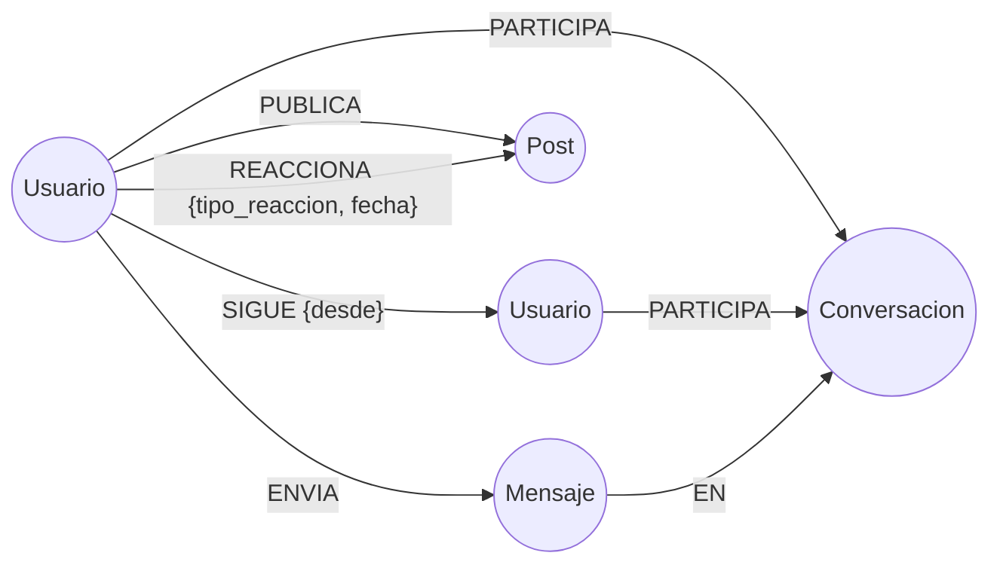

# Modelo del Grafo — Red Social Distribuida (Neo4j)

Este documento describe el modelo de datos en grafo de la aplicación y sus
convenciones. Algunas partes del modelo de chat representan el diseño de
conversaciones y semillas; la implementación activa del WebSocket se detalla
en la sección de chat de este documento.

> **Convención de nombres:** se usa `snake_case`, alineado con el acuerdo de API
> del equipo (`docs/CONTRATOS.md`, que se incorpora en el PR #16), para que
> los nombres de propiedad del grafo coincidan con los campos JSON del backend.
>
> **Regla de oro:** los archivos multimedia **NO** se guardan en Neo4j. En el
> grafo solo se guarda la *clave/URL* que apunta al objeto en MinIO (S3).

---

## 1. Diagrama del modelo



Patrón mínimo exigido por la actividad, ya cubierto:

```text
(:Usuario)-[:SIGUE]->(:Usuario)
(:Usuario)-[:PUBLICA]->(:Post)
(:Usuario)-[:REACCIONA]->(:Post)
```

---

## 2. Nodos (entidades)

### `:Usuario`
Representa a una persona registrada.

| Propiedad        | Tipo     | Notas                                              |
|------------------|----------|----------------------------------------------------|
| `id_usuario`     | String   | UUID. Identificador estable (no cambia nunca).     |
| `username`       | String   | Único. Nombre de usuario para login/mención.       |
| `email`          | String   | Único.                                             |
| `nombre`         | String   | Nombre visible en el perfil.                       |
| `bio`            | String   | Descripción del perfil (opcional).                 |
| `password_hash`  | String   | Contraseña **hasheada** (nunca en texto plano).    |
| `avatar_url`     | String   | Clave del objeto en MinIO/S3 (opcional).           |
| `fecha_registro` | DateTime | `datetime()` de creación.                          |

### `:Post`
Una publicación creada por un usuario.

| Propiedad           | Tipo     | Notas                                               |
|---------------------|----------|-----------------------------------------------------|
| `id_post`           | String   | UUID.                                               |
| `texto`             | String   | Contenido textual.                                  |
| `fecha_publicacion` | DateTime | Fecha y hora de publicación.                        |
| `media_url`         | String   | Clave del archivo en MinIO/S3 (opcional).           |
| `media_tipo`        | String   | `image`, `video`, etc. (opcional).                  |

### `:Conversacion` *(base para la issue #14 — chat)*
Un hilo de chat entre dos (o más) usuarios. Permite crecer a grupos sin cambiar el modelo.

| Propiedad          | Tipo     | Notas                    |
|--------------------|----------|--------------------------|
| `id_conversacion`  | String   | UUID.                    |
| `fecha_creacion`   | DateTime | Cuándo se inició.        |

### `:Mensaje` *(base para la issue #14 — chat)*
Un mensaje individual dentro de una conversación (historial del chat).

| Propiedad     | Tipo     | Notas                                  |
|---------------|----------|----------------------------------------|
| `id_mensaje`  | String   | UUID.                                  |
| `contenido`   | String   | Texto del mensaje.                     |
| `fecha_envio` | DateTime | Momento de envío.                      |
| `leido`       | Boolean  | Estado de lectura (opcional).          |

---

## 3. Relaciones

| Relación         | Dirección                          | Propiedades          | Significado                                   |
|------------------|------------------------------------|----------------------|-----------------------------------------------|
| `[:SIGUE]`       | `(:Usuario)-->(:Usuario)`          | `desde` (DateTime)   | A sigue a B. **Dirigida** (no es recíproca).  |
| `[:PUBLICA]`     | `(:Usuario)-->(:Post)`             | —                    | Autoría de una publicación.                   |
| `[:REACCIONA]`   | `(:Usuario)-->(:Post)`             | `tipo_reaccion`, `fecha` | Reacción (LIKE, LOVE, ...) a un post.     |
| `[:PARTICIPA]`   | `(:Usuario)-->(:Conversacion)`     | —                    | El usuario es parte de la conversación.       |
| `[:ENVIA]`       | `(:Usuario)-->(:Mensaje)`          | —                    | Quién escribió el mensaje.                     |
| `[:EN]`          | `(:Mensaje)-->(:Conversacion)`     | —                    | Relación del modelo de conversación usado en las semillas. |
| `[:DIRIGIDO_A]`  | `(:Mensaje)-->(:Usuario)`          | —                    | Destinatario del mensaje en el chat WebSocket activo. |

Notas de diseño:
- `SIGUE` es **dirigida**: `(A)-[:SIGUE]->(B)` no implica `(B)-[:SIGUE]->(A)`.
  La "amistad mutua" se detecta cuando existen las dos flechas.
- La reacción guarda `tipo_reaccion` **en la relación**, no en un nodo aparte. Así el
  mismo patrón sirve para LIKE/LOVE/HAHA cambiando solo una propiedad.
  *(Se usa `tipo_reaccion` según la issue #7. ⚠️ `CONTRATOS.md` lo lista como `tipo`;
  pendiente unificar con Said para que el backend lea el mismo nombre.)*
- El esquema y las semillas incluyen `Conversacion`, `PARTICIPA` y `EN` como
  modelo de conversación, con posibilidad de representar grupos.
- **Implementación activa del chat:** `ChatRepository` guarda cada mensaje con
  `(:Usuario)-[:ENVIA]->(:Mensaje)-[:DIRIGIDO_A]->(:Usuario)`. El historial se
  consulta entre el usuario autenticado y sus emisores/destinatarios, con un
  máximo de 500 mensajes. El endpoint WebSocket actual no crea ni consulta
  nodos `Conversacion`.

---

## 4. Restricciones e índices

Se aplican con el script [`backend/src/main/resources/neo4j/01-schema.cypher`](../backend/src/main/resources/neo4j/01-schema.cypher).

- **Restricciones de unicidad** en los `id_*` de cada nodo y en `username`/`email` de `Usuario`.
  (En Neo4j una restricción de unicidad crea automáticamente su índice de respaldo.)
- **Índice** en `Post.fecha_publicacion` para ordenar el feed por fecha de forma eficiente.

---

## 5. Consultas Cypher clave (resumen)

El detalle completo de las 5+ consultas no triviales vive en
`backend/src/main/resources/neo4j/03-consultas.cypher` (se incorpora en el PR de la issue #12).
Dos ejemplos que justifican el uso de un grafo:

**Feed personalizado** (posts de los usuarios que sigo, ordenados por fecha):
```cypher
MATCH (yo:Usuario {id_usuario: $miId})-[:SIGUE]->(seguido:Usuario)-[:PUBLICA]->(p:Post)
RETURN seguido.username AS autor, p.texto, p.fecha_publicacion
ORDER BY p.fecha_publicacion DESC
LIMIT 20;
```

**Recomendación de usuarios** ("a quién seguir": amigos de mis amigos que aún no sigo,
recorriendo **2 niveles** del grafo):
```cypher
MATCH (yo:Usuario {id_usuario: $miId})-[:SIGUE]->(:Usuario)-[:SIGUE]->(sugerido:Usuario)
WHERE sugerido <> yo AND NOT (yo)-[:SIGUE]->(sugerido)
RETURN sugerido.username AS recomendado,
       count(*)          AS en_comun      // más conexiones intermedias = mejor recomendación
ORDER BY en_comun DESC
LIMIT 5;
```
